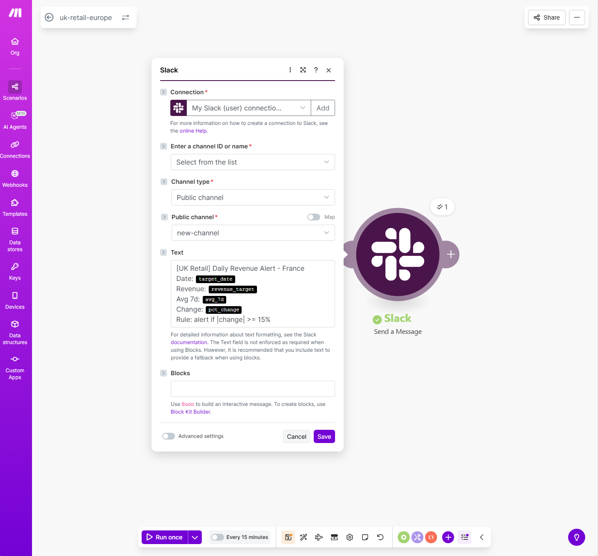

# Automation - Make.com Workflows

## Business Context

**Objective:** Automate operational monitoring and customer retention workflows for UK Retail e-commerce business.

**Use Cases:**
1. **Daily Revenue Monitoring** - Real-time anomaly detection for France market
2. **Weekly CRM Export** - Automated "At Risk" customer list for marketing campaigns

---

## Scenario 1: Daily Revenue Alert (BigQuery → Slack)

### **Workflow Overview**

**3 modules:**
1. **Google BigQuery - Run a Query** → Execute revenue analysis SQL
2. **Filter - "Send only if alert"** → Gate alerts based on threshold
3. **Slack - Send a Message** → Post formatted alert to channel

**Trigger:** Scheduled daily (configurable to 09:00 UTC)

---

### **Alert Logic**

**Threshold:** Revenue change ≥ 15% vs 7-day average

**Condition (BigQuery output):**
```sql
is_alert = (ABS(pct_change) >= 15)
```

**Filter rule (Make.com):**
- IF `is_alert = true` → Send Slack message
- ELSE → Skip (no noise in Slack channel)

---

### **Slack Message Format**

**Channel:** `#new-channel` (configurable)

**Message template:**
```
[UK Retail] Daily Revenue Alert - France

Date: {target_date}
Revenue: {revenue_target}
Avg 7d: {avg_7d}
Change: {pct_change}%

Rule: alert if |change| >= 15%
```

**Dynamic fields:** All values populated from BigQuery query results

---

### **SQL Query**

**File:** 

**Logic:**
- Compare yesterday's France revenue vs 7-day rolling average
- Calculate percentage change
- Set `is_alert` flag if threshold crossed

---

### **Screenshots**

**Workflow (Make.com):**


**Filter Inspector:**


**Slack Configuration:**


**Slack Message Received:**


---

### **Technical Notes**

**Challenges resolved:**
- BigQuery "illegal character" errors from copy-paste → Solution: Manual query rewrite in Make editor
- Filter logic validation → Confirmed via Filter Inspector (`is_alert = true`)

**Make.com operations:** ~30/month (1 query/day)

**Slack integration:** Webhook-based (no OAuth required)

---

## Scenario 3: Weekly At Risk Customer Export (BigQuery → Google Sheets)

### **Workflow Overview**

**2 modules:**
1. **Google BigQuery - Run a Query** → Extract At Risk customers from RFM segments
2. **Google Sheets - Add a Row** → Append to tracking spreadsheet

**Trigger:** Every Monday 08:00 UTC

---

### **Business Logic**

**Segment Definition:**
- **At Risk** = Customers with low recency (R ≤ 2) but moderate/high frequency (F ≥ 2)
- Translation: "Were active customers but haven't purchased recently"

**Recommended Actions (automated):**
- High spend (≥£500) → **10% voucher**
- Frequent buyers (≥3 orders) → **Free shipping offer**
- Others → **Welcome bundle** (based on Champion product analysis)

**Output:** Top 50 customers sorted by total spend (highest value first)

---

### **Google Sheets Export**

**Spreadsheet:** `UK_TEST3_AUTO`

**Sheet name:** `Sheet1` (configurable)

**Columns:**
| Column | Field | Description |
|--------|-------|-------------|
| A | CustomerID | Unique customer identifier |
| B | Country | Customer location |
| C | DaysSinceLastPurchase | Recency metric |
| D | TotalOrders | Frequency metric |
| E | TotalSpend | Monetary metric (£) |
| F | Segment | "At Risk" |
| G | RecommendedAction | Suggested reactivation offer |

**Update strategy:** Append new rows weekly (audit trail maintained)

---

### **SQL Query**

**File:** [weekly_at_risk_export.sql](File06_Automation/SQL/weekly_at_risk_export.sql)

**Logic:**
- Join RFM scores with customer dimension table
- Filter: R_Score ≤ 2 AND F_Score ≥ 2
- Sort by Monetary value descending
- Limit to top 50 customers

---

### **Screenshots**

**Workflow (Make.com):**


**Schedule Configuration:**


**Google Sheets Output:**


---

### **Integration with Dashboard 3**

This automation directly supports insights from **Dashboard 3 - Retention Analysis**:
- Dashboard identifies 1,280 At Risk customers (29% of base)
- Automation provides actionable weekly list for marketing team
- Recommended actions align with RFM segment characteristics

---

### **Technical Notes**

**Make.com operations:** ~4/month (1 export/week)

**Google Sheets:** Service account authentication (read/write permissions required)

**Data volume:** 50 rows/week = ~200 rows/month (manageable for free Google Sheets tier)

---

## Summary

### **Scenario 1 vs Scenario 3: Complementary Use Cases**

| Aspect | Scenario 1 | Scenario 3 |
|--------|-----------|-----------|
| **Frequency** | Daily | Weekly |
| **Type** | Reactive monitoring | Proactive action |
| **Audience** | Operations team | Marketing/CRM team |
| **Output** | Slack alert | Google Sheets list |
| **Trigger** | Anomaly detection | Scheduled export |
| **Business Goal** | Rapid response to revenue issues | Systematic customer reactivation |

---

## Tech Stack

- **Make.com** - Workflow automation platform (Free tier: 1,000 ops/month)
- **Google BigQuery** - Data warehouse & SQL engine
- **Slack** - Real-time alert delivery (Scenario 1)
- **Google Sheets** - CRM data export (Scenario 3)

---

## Setup Instructions

### **Prerequisites**
1. Make.com account (Free tier sufficient)
2. Google Cloud project with BigQuery enabled
3. Slack workspace with incoming webhook (Scenario 1)
4. Google Sheets with service account access (Scenario 3)

### **Scenario 1 Setup**
1. Create Slack incoming webhook
2. Configure BigQuery connection in Make
3. Import scenario or build: Schedule → BigQuery → Filter → Slack
4. Update SQL query with your project/dataset names
5. Test with "Run once" before scheduling

### **Scenario 3 Setup**
1. Create Google Sheet with headers (CustomerID, Country, etc.)
2. Share sheet with Make service account email
3. Configure BigQuery connection
4. Build workflow: Schedule → BigQuery → Google Sheets
5. Map BigQuery fields to sheet columns (A-G)
6. Set schedule: Monday 08:00 UTC

---

## Status

✅ **Scenario 1 completed and validated**
- BigQuery query executes successfully
- Filter gates alerts correctly
- Slack messages delivered

✅ **Scenario 3 completed and validated**
- RFM query returns At Risk customers
- Google Sheets integration functional
- Weekly schedule configured

---

## Future Enhancements (Optional)

**Scenario 1:**
- Multi-country alerts (UK, France, Belgium)
- Baseline comparison (same weekday, 4-week avg)
- Slack thread replies with diagnostic queries

**Scenario 3:**
- Email notification to marketing team
- Automated follow-up (2-week check if customer reactivated)
- A/B test tracking (which recommended action performed best)

---

## Evidence

All screenshots demonstrate end-to-end functionality for both scenarios.
